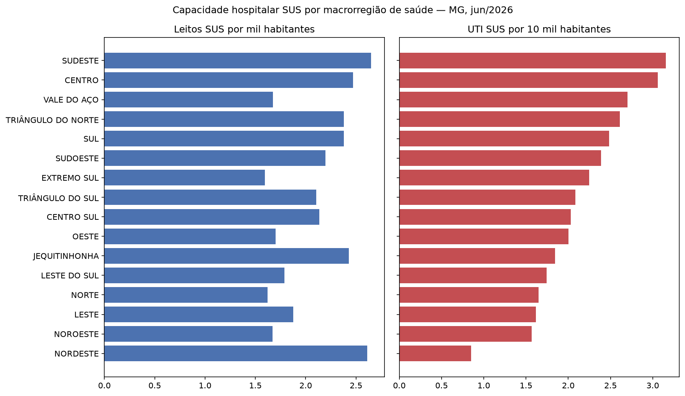
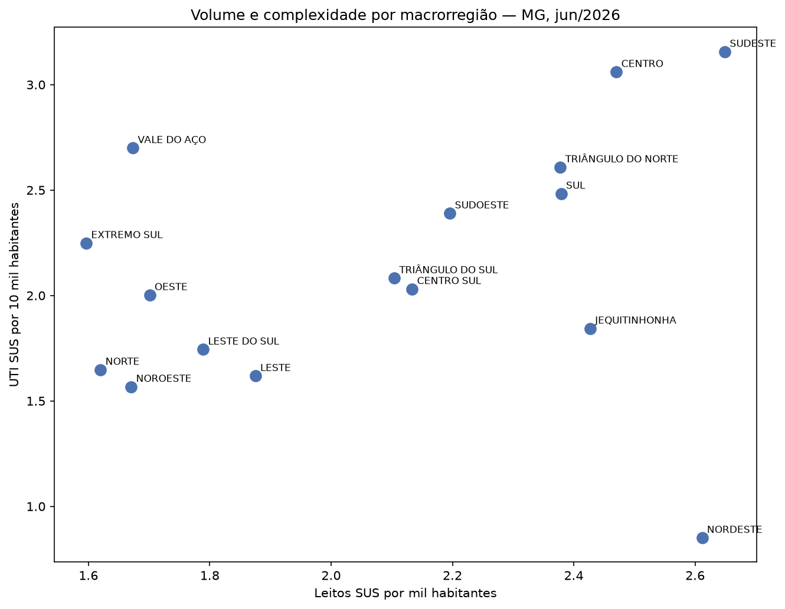

# Acesso a leitos SUS em Minas Gerais

Análise da distribuição de leitos hospitalares do SUS entre as regiões de saúde de Minas Gerais, a partir do Cadastro Nacional de Estabelecimentos de Saúde (CNES), da regionalização da SES-MG e da cobertura de planos privados da ANS.

---

## O achado

**Corrigido pela população que efetivamente depende do SUS, o volume de leitos gerais varia 1,7 vez entre as macrorregiões de Minas Gerais. A capacidade de UTI varia 3,7 vezes.**

A desigualdade territorial na saúde mineira não está principalmente no *quanto*, está no *quê*. Leitos de baixa complexidade estão distribuídos de forma relativamente uniforme pelo estado; leitos de terapia intensiva, não.

O caso mais nítido é a macrorregião Nordeste: **primeiro lugar do estado em leitos SUS por habitante (2,61 por mil) e último em UTI (0,85 por 10 mil)**. Apenas 3,3% dos seus leitos são de terapia intensiva, contra 16,1% no Vale do Aço. Quem precisa de UTI ali depende de deslocamento.

A dispersão separa dois problemas distintos. No canto inferior direito está a inversão: regiões com volume de leitos acima da média e capacidade de UTI abaixo — Nordeste, e em menor grau Jequitinhonha. A rede existe, falta complexidade. No canto inferior esquerdo está a escassez uniforme: Noroeste, Norte e Leste, abaixo da média nas duas dimensões. São situações que exigem respostas diferentes — qualificar a rede existente, num caso; ampliá-la, no outro.

Este achado sobreviveu a duas revisões metodológicas que desfizeram conclusões anteriores. A primeira versão da análise, feita por município, sugeria que metade de Minas Gerais era um vazio assistencial. A segunda, agregada por região mas usando população total como denominador, indicava que as regiões mais pobres tinham mais leitos SUS por habitante — resultado que se dissolveu quando o
denominador foi corrigido conforme a metodologia do Ministério da Saúde. A desigualdade em complexidade, ao contrário, aumentou sob a mesma correção.

---

## Panorama por macrorregião

Competência 06/2026. Taxas calculadas sobre a população dependente do SUS — isto é, descontada a cobertura de planos privados de cada região. Ordenado pela capacidade de UTI.

| Macrorregião | Cobertura ANS | Leitos SUS /mil | UTI SUS /10 mil | UTI sobre leitos | Da UTI, quanto é SUS |
|---|---|---|---|---|---|
| Nordeste | 7,7% | 2,61 | 0,85 | 3,3% | 80,5% |
| Noroeste | 20,5% | 1,67 | 1,57 | 9,4% | 52,2% |
| Leste | 16,1% | 1,88 | 1,62 | 8,6% | 65,0% |
| Norte | 9,4% | 1,62 | 1,65 | 10,2% | 73,0% |
| Leste do Sul | 12,3% | 1,79 | 1,74 | 9,7% | 79,0% |
| Jequitinhonha | 8,7% | 2,43 | 1,84 | 7,6% | 68,4% |
| Oeste | 31,4% | 1,70 | 2,00 | 11,8% | 49,6% |
| Centro Sul | 25,4% | 2,13 | 2,03 | 9,5% | 73,3% |
| Triângulo do Sul | 33,3% | 2,10 | 2,08 | 9,9% | 63,2% |
| Extremo Sul | 27,4% | 1,60 | 2,25 | 14,1% | 69,2% |
| Sudoeste | 15,5% | 2,20 | 2,39 | 10,9% | 82,7% |
| Sul | 24,2% | 2,38 | 2,48 | 10,4% | 62,6% |
| Triângulo do Norte | 28,6% | 2,38 | 2,61 | 11,0% | 58,1% |
| Vale do Aço | 31,2% | 1,67 | 2,70 | 16,1% | 67,9% |
| Centro | 39,5% | 2,47 | 3,06 | 12,4% | 50,1% |
| Sudeste | 24,0% | 2,65 | 3,16 | 11,9% | 60,4% |

A coluna de cobertura mostra por que a correção importa: a proporção da população com plano privado varia de 7,7% no Nordeste a 39,5% no Centro — mais de cinco vezes.





---

## O caminho até aqui: duas hipóteses corrigidas pelos dados

O projeto partiu da expectativa de encontrar desertos assistenciais no interior. Os dados corrigiram essa leitura duas vezes.

**Primeira correção: o município é a unidade errada.** Dos 853 municípios de Minas, apenas **409 (48%)** possuem estabelecimento com leito cadastrado. Os 444 restantes aparecem como vazios absolutos — literalmente verdadeiro, praticamente falso, já que a população se trata em municípios vizinhos. Belo Horizonte sozinha concentra 19% dos leitos SUS do estado (6.403 de 33.607) e os dez maiores municípios somam 40,3%. Daí a agregação por região de saúde.

**Segunda correção: o denominador populacional.** Na primeira rodada de cálculo, usando a população total como denominador, as regiões mais pobres apareciam com muito mais leitos SUS por habitante que as metropolitanas — Nordeste com 2,41 por mil contra 1,50 no Centro. O resultado sugeria uma inversão surpreendente da desigualdade esperada.

A revisão do documento *Critérios e Parâmetros Assistenciais SUS* (Ministério da Saúde, Caderno 1, 2017) revelou o problema: o Quadro 37 define a população de referência para leitos SUS como a população **sem plano de saúde**, não a população total. Como a cobertura suplementar varia cinco vezes entre as regiões de Minas, o denominador estava distorcendo a comparação.

Refeito o cálculo com os dados de cobertura da ANS, a diferença nos leitos gerais encolheu de 2,1x para 1,7x — o Centro saltou de 1,50 para 2,47 e passou a figurar entre os melhores. A inversão aparente era, em boa parte, artefato de denominador.

**A desigualdade em UTI, porém, fez o movimento oposto: cresceu de 3,1x para 3,7x.** É esse contraste — volume relativamente uniforme, complexidade fortemente concentrada — que sustenta a conclusão do trabalho, e ele sobrevive à correção metodológica que desfez o achado anterior.

---

## Fontes de dados

| Fonte | Conteúdo | Recorte |
|---|---|---|
| [CNES — Leitos](https://dadosabertos.saude.gov.br/dataset/hospitais-e-leitos) | Estabelecimentos, leitos existentes, leitos SUS e leitos de UTI, por competência mensal | 01/2026 a 06/2026 |
| [SES-MG — Planilha de Regionalização](https://www.saude.mg.gov.br/estudos-assistenciais-e-regionalizacao/) | Municípios, população e classificação por unidade regional, microrregião e macrorregião de saúde | Versão 2026 (ajuste do PDR 2025) |
| [ANS — Taxa de Cobertura de Planos de Saúde](https://dados.gov.br/dados/conjuntos-dados/taxa-de-cobertura-de-planos-de-saude) | Percentual da população com plano privado de assistência médica, por município | Dez/2025 |

CNES e ANS estão catalogados no [Portal Brasileiro de Dados Abertos](https://dados.gov.br/).

A planilha da SES-MG cobre os 853 municípios do estado, distribuídos em 89 microrregiões, 16 macrorregiões e 28 unidades regionais de saúde, sem valores ausentes.

---

## Decisões metodológicas

**População dependente do SUS como denominador.** Seguindo o Quadro 37 do Caderno 1 de Parâmetros Assistenciais, as taxas por habitante usam a população descontada da cobertura de planos privados: `população municipal × (1 − taxa de cobertura ANS)`. Aplicou-se o percentual da ANS sobre a base populacional da SES-MG, em vez de usar os números absolutos de beneficiários, para manter uma única fonte populacional e evitar divergência entre bases.

**Agregação por região de saúde, não por município.** Apenas 409 dos 853 municípios de MG possuem estabelecimento com leito. Uma análise municipal produziria 444 falsos desertos assistenciais. As regiões de saúde do PDR-MG refletem os fluxos reais de atendimento e não coincidem com as divisões geográficas do IBGE.

**Macrorregião como recorte principal, microrregião como verificação.** Na escala microrregional, a razão entre a maior e a menor taxa de leitos SUS é de 5,5x; na macrorregional, cai para 2,1x (sem ajuste de denominador). A diferença revela um efeito de vizinhança: microrregiões limítrofes a grandes polos (Contagem, Betim, Vespasiano) aparecem artificialmente vazias porque sua população é atendida na capital. O recorte macro, por ser o mais conservador, foi adotado para as conclusões.

**`LEITOS_SUS`, não `LEITOS_EXISTENTES`.** A base do CNES inclui estabelecimentos privados sem vínculo com o SUS. Contabilizar leitos existentes superestimaria o acesso público — é comum um estabelecimento privado registrar dezenas de leitos existentes e zero leitos SUS.

**UTI não é somada ao total de leitos.** Os campos `UTI_*_SUS` são subconjunto de `LEITOS_SUS`, não contagem paralela. Verificação: em nenhum registro a UTI excede o total de leitos, e não há UTI em estabelecimento sem leitos SUS. Somar os dois campos produziria dupla contagem.

**Capacidade instalada e capacidade disponível ao SUS medidas separadamente.** A coluna "da UTI, quanto é SUS" compara `UTI_TOTAL_SUS` com `UTI_TOTAL_EXIST`, distinguindo o que existe na região do que está efetivamente disponível ao sistema público.

**População agregada a partir da base completa de municípios.** O denominador vem da planilha da SES-MG com os 853 municípios, não do resultado da junção com o CNES. A junção contém apenas os 409 municípios com estabelecimento, e nela cada município aparece uma vez por estabelecimento — somar a população desse recorte produziria mais de 220 milhões de habitantes para um estado de 21,4 milhões.

**Chave de junção: código DATASUS de 6 dígitos.** O campo `CO_IBGE` do CNES usa o código municipal sem o dígito verificador, enquanto o código IBGE completo tem 7 dígitos. A planilha da SES-MG traz as duas versões e o arquivo da ANS usa o de 6, permitindo junção direta sem conversão. Validado: nenhum registro ficou sem correspondência nas três bases.

**Competência 06/2026 para o retrato principal.** Cada estabelecimento aparece uma vez por competência. As seis competências disponíveis permitem observar variação ao longo do primeiro semestre.

**Duas métricas separadas, não um índice combinado.** Seria possível resumir volume e complexidade num único indicador, mas isso apagaria o achado central: uma região com muitos leitos gerais e pouca UTI produziria um valor médio, indistinguível de uma região mediana nas duas dimensões. São situações clinicamente e administrativamente distintas. O Nordeste é o caso extremo — primeiro em volume, último em complexidade — e qualquer agregação o colocaria no meio da distribuição.

---

## Sobre parâmetros de referência

A Portaria GM/MS nº 1.101/2002, que fixava parâmetros de cobertura hospitalar por habitante, foi revogada em 2015. O documento vigente — *Critérios e Parâmetros Assistenciais SUS*, Caderno 1, revisão de 2017 — abandonou deliberadamente a lógica de taxa fixa.

Para leitos gerais e de UTI, o Caderno propõe uma fórmula que combina internações esperadas, tempo médio de permanência, taxa de ocupação e fator de recusa, calculada separadamente por tipo de leito-especialidade. Os poucos parâmetros populacionais diretos são específicos: 2 leitos de UTI neonatal por 1.000 nascidos vivos, e UTI adulto obstétrica como percentual dos leitos obstétricos necessários na região.

Este trabalho, portanto, **não afirma adequação ou inadequação frente a um parâmetro normativo** — nenhum se aplica diretamente às métricas aqui calculadas. Todas as comparações são relativas, entre regiões do mesmo estado sob o mesmo sistema.

---

## Limitações

**Beneficiários de planos coletivos podem ser registrados fora do município de residência.** As notas metodológicas da ANS advertem que planos coletivos empresariais podem vincular o beneficiário ao município sede da empresa contratante. O efeito provável é inflar a cobertura aparente em regiões com concentração de sedes — justamente as metropolitanas — e, por consequência, subestimar sua população dependente do SUS e superestimar suas taxas corrigidas.

**Defasagem entre as bases.** Leitos referem-se a 06/2026, cobertura da ANS a 12/2025 e população à planilha SES-MG versão 2026. As diferenças de data são de meses, não de anos, mas existem.

**Dados autodeclarados.** A documentação do CNES registra que as informações são enviadas pelos gestores locais de saúde. A qualidade do cadastro varia entre municípios, e este trabalho não tem como verificar a acurácia dos registros.

**Leito cadastrado não é leito em operação.** A existência de um leito no cadastro não garante disponibilidade efetiva, equipe ou insumos.

**A separação entre leito geral e UTI não esgota a complexidade.** UTI é um indicador de alta complexidade, mas não o único. Oncologia, hemodinâmica e transplantes não são capturados por esta análise.

**Capacidade, não desfecho.** O estudo mede oferta instalada, não acesso efetivo, tempo de espera, taxa de ocupação ou qualidade do atendimento.

**Fluxos interestaduais não considerados.** Municípios de divisa podem ter parte de sua população atendida em outros estados, o que não é capturado por um recorte restrito a Minas Gerais.

**Perfil etário não considerado.** Regiões mais envelhecidas tendem a demandar mais leitos de alta complexidade, o que uma taxa uniforme por habitante não captura.

**Recorte temporal curto.** Seis competências de um mesmo semestre não permitem conclusões sobre tendências de longo prazo.

---

## Reprodução

```bash
git clone https://github.com/snowdevelops/acesso-leitos-sus-mg.git
cd acesso-leitos-sus-mg
python3 -m venv venv
source venv/bin/activate
pip install -r requirements.txt
```

Os dados brutos não são versionados (ver `.gitignore`). Baixe os arquivos das fontes listadas acima e coloque em `data/raw/`:

- `Leitos_2026.csv` — CNES (distribuído em `.zip`; extrair antes de usar)
- `Planilha-de-Regionalizacao_Versao-2026.xlsx` — SES-MG
- `A12332510_22_1_196.csv` — ANS, exportado do TABNET (Assistência Médica por Município, UF Minas Gerais, Dez/2025)

Os três arquivos exigem parâmetros de leitura específicos:

```python
leitos = pd.read_csv('../data/raw/Leitos_2026.csv', sep=';', encoding='latin-1')

regiao = pd.read_excel(
    '../data/raw/Planilha-de-Regionalizacao_Versao-2026.xlsx',
    skiprows=2, nrows=853
)

cobertura = pd.read_csv(
    '../data/raw/A12332510_22_1_196.csv',
    sep=';', encoding='latin-1', skiprows=4, decimal=',', nrows=853
)
```

O `nrows` corta as linhas de fonte e totalização no rodapé de cada arquivo. No CSV da ANS, código e nome do município vêm no mesmo campo e são separados por posição: `cobertura['municipio_raw'].str[:6]`.

---

## Estrutura

```
├── data/
│   ├── raw/          # dados originais (não versionados)
│   └── processed/    # dados tratados
├── notebooks/
│   └── 01-exploracao.ipynb
├── figuras/
│   ├── leitos_vs_uti.png
│   └── dispersao_leitos_uti.png
└── README.md
```

---

## Autor

Luiz Fernando Lemos Gondim — [@snowdevelops](https://github.com/snowdevelops)

Projeto desenvolvido para o 2º Concurso de Reúso de Dados Abertos da CGU.